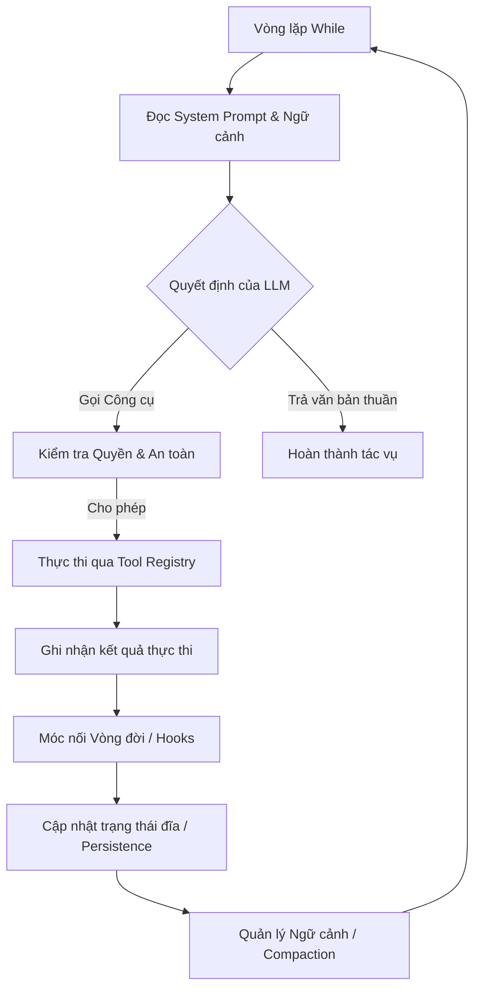

<p align="center">
  <a href="https://harness.nguyenanh98.com">
    
  </a>
</p>

<p align="center">
  <em>The practical guide to building AI agent harnesses — with real code examples you can copy and run.</em>
</p>

<p align="center">
  <a href="https://github.com/nguyenanh92/harness-kit/stargazers"></a>
  <a href="https://github.com/nguyenanh92/harness-kit/blob/main/LICENSE"></a>
</p>

<p align="center">
  🌐 <b><a href="https://harness.nguyenanh98.com">harness.nguyenanh98.com</a></b>
</p>

<p align="center">
  <a href="README.md">English</a> | <b>Tiếng Việt</b>
</p>

---

## Cài đặt

Chạy lệnh này tại **thư mục gốc của project** — hoạt động với Claude Code, Cursor, Codex, Windsurf và bất kỳ AI nào đọc instruction file.

```bash
# macOS / Linux
curl -fsSL https://raw.githubusercontent.com/nguyenanh92/harness-kit/main/install.sh | sh

# Windows (PowerShell)
irm https://raw.githubusercontent.com/nguyenanh92/harness-kit/main/install.ps1 | iex
```

**Yêu cầu:** Python 3.8+, git

Những file được tạo trong project của bạn:

| File | Mục đích |
|---|---|
| `AGENTS.md` | Quy tắc AI đọc mỗi khi bắt đầu session |
| `feature_list.json` | Feature đang làm, trạng thái, dependencies |
| `progress.md` | AI ghi tiến độ sau mỗi session |
| `init.sh` / `init.ps1` | Script kiểm tra (tests, lint, build) |
| `session-handoff.md` | Ngữ cảnh cho session tiếp theo |

> Dùng `--agent-file CLAUDE.md` nếu tool của bạn đọc `CLAUDE.md` thay vì `AGENTS.md`.

---

# Tài Liệu Chuyên Sâu: Tìm Hiểu Về Agent Harness (Khung Kiến Trúc Tác Nhân AI)

Tài liệu này được tổng hợp từ bài chia sẻ thực tế kết hợp với việc đối chiếu, phân tích các mẫu thiết kế kỹ thuật (design patterns) hiện có trong dự án **harness-kit**.

---

## 1. Định nghĩa Agent Harness (Harness là gì?)

**Agent Harness** (Khung gá/Đai an toàn của tác nhân) là **một kiến trúc cố định dùng để chuyển đổi một mô hình ngôn ngữ lớn (LLM) tĩnh thành một tác nhân hoạt động độc lập (Agent)**.

* **LLM tĩnh (Động cơ - Engine)**: Bản chất các mô hình ngôn ngữ lớn hiện tại là bộ tạo văn bản một lượt (One-shot text generator). Người dùng gửi câu hỏi, mô hình trả lời và dừng lại. Nó không có khả năng tự sửa lỗi, không có khả năng hành động và không tự động đi tiếp nếu không có sự can thiệp từ con người.
* **Harness (Khung xe - Car)**: Là hệ thống bao bọc xung quanh LLM, cung cấp cho nó khả năng thực hiện hành động (thông qua công cụ), quan sát kết quả của hành động đó, tự điều chỉnh và lặp lại cho đến khi giải quyết triệt để vấn đề.

> [!NOTE]
> **Công thức cốt lõi:**
> $$\text{Mô hình LLM (Động cơ)} + \text{Harness (Khung xe và Hệ thống lái)} = \text{AI Agent (Chiếc xe tự hành)}$$

*Ví dụ thực tế:* Các công cụ lập trình AI như **Claude Code, Cursor, Windsurf, hay Codex** chính là các Agent Harness. Mỗi công cụ đều xuất phát từ một bài toán cụ thể: làm thế nào để mô hình LLM có thể tự đọc, viết, sửa đổi và kiểm thử mã nguồn trên một kho lưu trữ (repository) thực tế một cách an toàn và nhất quán.

---

## 2. Phân biệt rõ ràng: Harness vs. Agent Framework

Hiện nay, nhiều người thường sử dụng lẫn lộn hai khái niệm này. Tuy nhiên, sự khác biệt giữa chúng là vô cùng lớn:

| Tiêu chí | Agent Framework (LangChain, LangGraph, AutoGen, CrewAI...) | Agent Harness (Claude Code, Cursor, Windsurf...) |
| :--- | :--- | :--- |
| **Mục đích** | Cung cấp các khối trừu tượng (state, chains, memory, retrievers) để lập trình viên sử dụng. | Cung cấp một tác nhân (Agent) hoàn chỉnh đã được lắp ráp sẵn để thực thi tác vụ trực tiếp. |
| **Đối tượng lắp ráp** | **Human-centric**: Người xây dựng (lập trình viên) phải tự viết code để liên kết các thành phần lại với nhau. | **Agent-centric**: Được thiết kế để chính Agent tự sử dụng các công cụ mà không cần con người lập trình lại. |
| **Tính sẵn sàng** | Cần bước phát triển và cấu hình luồng chạy từ con người trước khi dùng. | Không cần bước lắp ráp; người dùng chỉ cần cung cấp mục tiêu cuối cùng (Goal), Harness sẽ tự xử lý phần còn lại. |
| **Cấu trúc cốt lõi** | Tập hợp các class, thư viện SDK, các trừu tượng hóa mức cao. | Một vòng lặp `while` kết hợp với Tool Registry, Permission Layer, và Context Management. |

---

## 3. 9 Thành Phần Cốt Lõi Của Một Modern Agent Harness

Một Harness hiện đại được xây dựng dựa trên 9 thành phần bổ trợ chặt chẽ cho nhau để giúp Agent hoạt động an toàn và hiệu quả:



### 3.1. Vòng Lặp While (The While Loop)
Là nền móng của cả hệ thống điều phối. Harness chạy một vòng lặp `while` liên tục: đọc ngữ cảnh $\rightarrow$ LLM chọn công cụ $\rightarrow$ thực thi công cụ $\rightarrow$ nạp kết quả vào ngữ cảnh $\rightarrow$ lặp lại. Vòng lặp chỉ dừng khi LLM đưa ra câu trả lời thuần văn bản (hoàn thành tác vụ) hoặc khi chạm giới hạn số lần lặp tối đa (Iteration Cap) để tránh lặp vô hạn.

### 3.2. Quản Lý Ngữ Cảnh (Context Management)
Khi phiên làm việc kéo dài, lịch sử hội thoại và kết quả chạy công cụ sẽ tăng lên nhanh chóng và dễ làm tràn giới hạn token (Context Window) của LLM.
* **Compaction (Nén)**: Khi ngữ cảnh đạt tới ~95% cửa sổ ngữ cảnh của mô hình (có thể cấu hình qua `CLAUDE_AUTOCOMPACT_PCT_OVERRIDE`), Harness sẽ tự động tóm tắt các lượt hội thoại cũ, giữ nguyên system prompt và các lượt gần nhất. Hook `PreCompact` được kích hoạt trước khi nén, cho phép lưu trữ bản sao toàn bộ transcript.
* **Progressive Disclosure**: Chỉ tải ngữ cảnh khi cần thiết (Just-In-Time) để giảm độ trễ khởi động phiên và tối ưu chi phí token.

### 3.3. Đăng Ký Công Cụ & Kỹ Năng (Tools & Skills Registry)
* **Tools (Công cụ)**: Các nguyên bản (primitives) cơ bản và phổ quát như đọc file, viết file, chạy bash, tìm kiếm mã nguồn.
* **Skills (Kỹ năng)**: Lớp kiến thức nâng cao hơn về quy trình làm việc (thường được định nghĩa trong các file markdown cấu hình), ví dụ: cách tạo git commit chuẩn, cách chạy test suite của dự án.
* **Registry**: Quản lý ánh xạ tên công cụ, mô tả, quyền hạn yêu cầu và hàm xử lý (handler). Registry sẽ gửi danh sách mô tả rút gọn sang LLM để nó biết mình có thể làm những gì.

### 3.4. Quản Lý Tác Nhân Con (Sub-agent Management)
Khi một tác vụ quá lớn hoặc cần xử lý song song, luồng hội thoại chính sẽ bị quá tải token. Harness giải quyết bằng cách khởi tạo các tác nhân con (Sub-agents) hoạt động cô lập. Mỗi tác nhân con sẽ có một session riêng, danh sách công cụ hạn chế và một system prompt cực kỳ tập trung.
* *Nguyên lý*: **Spawn (Phát triển)** $\rightarrow$ **Restrict (Giới hạn quyền)** $\rightarrow$ **Collect (Thu thập kết quả)**.

### 3.5. Kỹ Năng Tích Hợp Sẵn (Built-in Skills)
Các công cụ cơ bản bắt buộc phải có của một coding agent (thao tác file, chạy shell, duyệt mã nguồn). Những công cụ này nên được viết bằng thư viện chuẩn (standard libraries) của ngôn ngữ lập trình, không nên phụ thuộc vào các framework bên ngoài để đảm bảo Agent hoạt động ổn định và cực kỳ nhanh chóng.

### 3.6. Lưu Trữ Phiên & Bộ Nhớ (Session Persistence / Memory)
Các phiên làm việc dài là các trạng thái liên tục (stateful). Nếu tiến trình hoặc terminal bị sập, toàn bộ lịch sử sẽ mất trừ khi Harness ghi dữ liệu xuống đĩa.
* *Cách thực hiện*: Sử dụng các file ghi nhật ký dạng **Append-only JSON** (hoặc Markdown). Mỗi hành động, kết quả công cụ hay sự kiện nén ngữ cảnh được ghi trên một dòng và lập tức ghi xuống đĩa (flush). Khi cần khôi phục, Harness chỉ cần đọc và chạy lại tuần tự (replay) các sự kiện để dựng lại trạng thái phiên ban đầu.

### 3.7. Lắp Ghép Prompt Hệ Thống (System Prompt Assembly)
System Prompt không phải là một chuỗi tĩnh cứng nhắc mà là một pipeline động. Nó sẽ tìm kiếm các tệp tin chỉ dẫn đặc thù của dự án (như `CLAUDE.md`, `AGENTS.md` hoặc `.claudemd`) trong thư mục dự án và các thư mục cha để tự động ghép vào System Prompt của Agent.
* **Lưu ý**: Cần đặt phần prompt tĩnh ở đầu và phần động ở sau để bảo toàn cơ chế **Prompt Caching** của mô hình, tránh việc thay đổi nhỏ làm mất bộ đệm cache gây tốn chi phí và thời gian.

### 3.8. Móc Nối Vòng Đời (Lifecycle Hooks)
Cho phép mở rộng tính năng của Harness mà không cần sửa đổi mã nguồn cốt lõi của nó:
* **Pre-tool Hook**: Chạy trước khi thực thi công cụ. Có thể kiểm tra tham số, cho phép, từ chối hoặc sửa đổi cuộc gọi.
* **Post-tool Hook**: Chạy sau khi thực thi công cụ để giám sát, ghi log hoặc kiểm tra kết quả đầu ra.
* *Ý nghĩa*: Đây là cách để các doanh nghiệp lớn áp dụng các bộ quy tắc bảo mật và giám sát Agent của mình.

### 3.9. Phân Quyền & An Toàn (Permissions & Safety)
Là lớp bảo vệ ngăn chặn Agent thực hiện các hành động phá hoại hệ thống của người dùng:
* **Cấp độ phân quyền**: Định nghĩa rõ các cấp độ (Read-only, Workspace Write, Full Access).
* **Phân loại động (Dynamic Classification)**: Với các lệnh Shell, Harness phân tích cú pháp câu lệnh theo thời gian thực (ví dụ: `cat file.txt` là Read-only, nhưng `rm -rf` hoặc `shutdown` sẽ yêu cầu quyền Full Access).
* **Interactive Approvals**: Tạm dừng vòng lặp và yêu cầu xác nhận trực tiếp từ người dùng thông qua giao diện trước khi thực thi các lệnh nguy hiểm.

---

## 4. Ánh Xạ Với Hệ Thống Đánh Giá Của Dự Án (harness-kit)

Trong dự án hiện tại của chúng ta (`harness-kit`), công cụ đánh giá cấu trúc Harness (`skills/scripts/validate_harness.py`) kiểm tra chất lượng dựa trên **5 hệ thống con (Subsystems)**. Chúng ta có thể ánh xạ 9 thành phần cốt lõi của Harness ở trên vào 5 subsystem này như sau:

| 5 Subsystems (harness-kit) | Thành phần Harness tương ứng | Ý nghĩa & Cách triển khai thực tế |
| :--- | :--- | :--- |
| **1. Instructions (Chỉ dẫn)** | • System Prompt Assembly<br>• Tools & Skills Registry | Cung cấp chỉ dẫn cách Agent vận hành. Đọc file `AGENTS.md`/`CLAUDE.md` để nạp luật chơi cho Agent và mô tả các công cụ có sẵn. |
| **2. State (Trạng thái)** | • Session Persistence<br>• Context Management | Lưu trữ tiến trình thực thi ra file đĩa (`progress.md`, `session-handoff.md`) và quản lý bộ nhớ đệm lịch sử hội thoại (nén token). |
| **3. Verification (Xác minh)** | • Built-in Skills (Test suite) | Khả năng tự động kiểm tra mã nguồn (qua `init.sh` hoặc chạy lệnh test) để Agent xác nhận thay đổi của mình là đúng đắn trước khi bàn giao. |
| **4. Scope (Phạm vi)** | • Permissions & Safety<br>• Sub-agent Isolation | Đặt ra biên giới hoạt động cho Agent. Giới hạn các file được phép sửa đổi (`feature-list.json`), chặn thoát khỏi thư mục dự án và phân quyền Shell. |
| **5. Lifecycle (Vòng đời)** | • While Loop<br>• Lifecycle Hooks | Quản lý vòng đời hoạt động từ lúc khởi động, bàn giao phiên (`session-handoff.md`), đến khi dừng tác vụ. |

---

## 5. Những Cạm Bẫy Phổ Biến (Gotchas) Trong Thiết Kế Harness

Dưới đây là các lỗi thiết kế hệ thống Harness phổ biến đã được kiểm chứng thực tế:

1. **Tràn bộ nhớ ẩn (Silent Memory Caps)**: Các chỉ mục bộ nhớ đệm thường giới hạn dung lượng lưu trữ (ví dụ 25KB). Nếu Agent lưu các đoạn tóm tắt quá dài dòng, thông tin cũ sẽ bị cắt bỏ âm thầm mà không báo lỗi. 
   * *Khắc phục*: Thiết kế các thẻ lưu trữ dạng một dòng ngắn gọn và lưu chi tiết vào file riêng.
2. **Xung đột thời điểm trích xuất (Extraction Timing Race)**: Quá trình trích xuất thông tin hội thoại để lưu vào bộ nhớ thường diễn ra cuối lượt trả lời. Nếu người dùng gửi tin nhắn tiếp theo quá nhanh trước khi quá trình ghi nhớ hoàn tất, Agent sẽ bị mất ngữ cảnh của lượt hội thoại trước đó.
3. **Phân loại concurrency theo lượt gọi thay vì theo công cụ**: Không nên đánh giá một công cụ là an toàn hay nguy hiểm một cách tĩnh. 
   * *Khắc phục*: Phải phân tích các tham số truyền vào công cụ tại thời điểm chạy (runtime) để quyết định mức độ an toàn.
4. **Fork con không được tạo Fork tiếp**: *Fork* (sub-agent thừa kế toàn bộ lịch sử hội thoại) bị giới hạn một cấp — fork con không được tạo fork tiếp. Sub-agent thông thường (context riêng biệt) có thể lồng nhiều cấp; chỉ có kiểu fork đầy đủ lịch sử mới phải giữ giới hạn một cấp để chi phí token có thể dự đoán được.
5. **Quên xóa cache khi sửa đổi file (Cache Invalidation)**: Khi Agent thực hiện cập nhật nội dung file, Harness phải xóa cache của file đó ngay lập tức, tránh việc các công cụ khác đọc lại dữ liệu cũ đã lưu cache.
6. **Tin cậy Hook theo phân cấp phạm vi, không phải nhị phân**: Tin cậy Hook tuân theo phân cấp 7 phạm vi (managed policy → user settings → project settings → local settings → plugin → skill frontmatter → enterprise lock). Hook từ user settings chạy ngay cả khi workspace không được tin cậy; chỉ `allowManagedHooksOnly` mới tạo ra cổng tất-cả-hoặc-không thực sự. Trong từng phạm vi, tin cậy vẫn là tất-cả-hoặc-không — không cố lọc hook nào "trông có vẻ an toàn".
