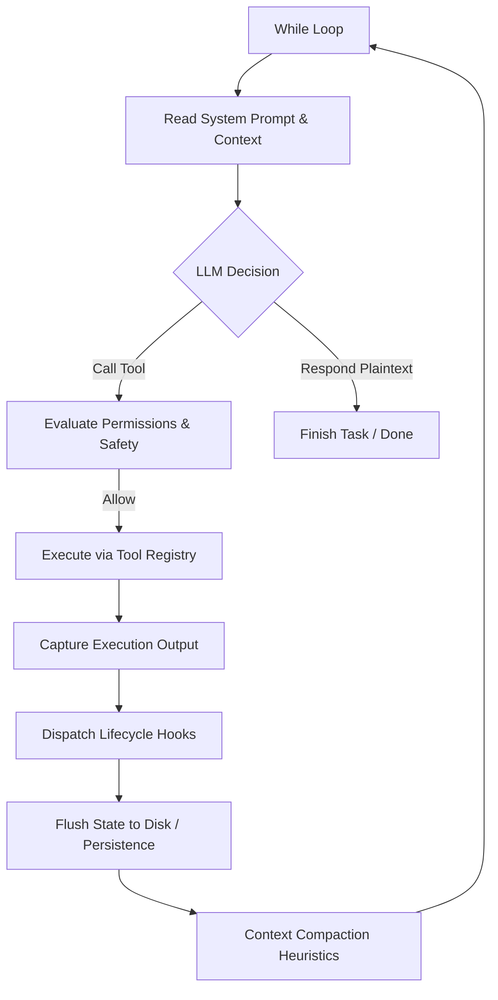

<p align="center">
  <a href="https://harness.nguyenanh98.com">
    
  </a>
</p>

<p align="center">
  <em>The practical guide to building AI agent harnesses — with real code examples you can copy and run.</em>
</p>

<p align="center">
  <a href="https://github.com/nguyenanh92/harness-kit/stargazers"></a>
  <a href="https://github.com/nguyenanh92/harness-kit/blob/main/LICENSE"></a>
</p>

<p align="center">
  🌐 <b><a href="https://harness.nguyenanh98.com">harness.nguyenanh98.com</a></b>
</p>

<p align="center">
  <b>English</b> | <a href="README-VI.md">Tiếng Việt</a>
</p>

---

## Install

Run this in your **project root** — works with Claude Code, Cursor, Codex, Windsurf, and any AI that reads an instruction file.

```bash
# macOS / Linux
curl -fsSL https://raw.githubusercontent.com/nguyenanh92/harness-kit/main/install.sh | sh

# Windows (PowerShell)
irm https://raw.githubusercontent.com/nguyenanh92/harness-kit/main/install.ps1 | iex
```

**Requirements:** Python 3.8+, git

What gets created in your project:

| File | Purpose |
|---|---|
| `AGENTS.md` | Rules your AI reads on every session start |
| `feature_list.json` | Active feature, status, dependencies |
| `progress.md` | AI writes progress here after each session |
| `init.sh` / `init.ps1` | Verification script (tests, lint, build) |
| `session-handoff.md` | Context for the next session |
| `hk.py` | Workflow CLI — add features, track progress, audit score |

> Use `--agent-file CLAUDE.md` if your tool reads `CLAUDE.md` instead of `AGENTS.md`.  
> Use `--full` to also install the Python runtime (agent loop, sub-agents, hooks) — needed for programmatic automation.

**Day-to-day with `hk.py`** (works from any IDE terminal, no plugin required):

```bash
py hk.py feature "Settings screen"   # add a feature
py hk.py start F-001                  # set it active
py hk.py status                       # see queue + next tip
py hk.py done                         # verify then mark done
py hk.py audit                        # score the harness
```

---

# Deep Dive: Understanding Agent Harness (AI Agent Architecture)

This document is compiled from practical observations combined with an analysis of the engineering design patterns available in the **harness-kit** project.

---

## 1. Definition of an Agent Harness (What is a Harness?)

An **Agent Harness** is **a fixed architecture that wraps around a Large Language Model (LLM) to turn it into an autonomous Agent**.

*   **LLM (Engine)**: By nature, modern LLMs are one-shot text generators. You ask a question, the model responds, and it stops. It cannot navigate a codebase, verify its changes, or retry after an error on its own.
*   **Harness (Car & Steering)**: The environment and execution loop that gives the LLM the ability to take action (via tools), observe the outcomes, self-correct, and loop until the objective is fully met.

> [!NOTE]
> **Core Formula:**
> $$\text{LLM Model (Engine)} + \text{Harness (Car / Steering)} = \text{AI Agent (Autonomous Vehicle)}$$

*Real-world example:* Agentic coding tools like **Claude Code, Cursor, Windsurf, and Codex** are Agent Harnesses. Each was built around a concrete problem: letting a model read, write, edit, and test code across a real codebase safely and reliably.

---

## 2. Distinction: Harness vs. Agent Framework

It is common to confuse these two terms, but their architectural goals are fundamentally different:

| Criteria | Agent Framework (LangChain, LangGraph, AutoGen, CrewAI...) | Agent Harness (Claude Code, Cursor, Windsurf...) |
| :--- | :--- | :--- |
| **Objective** | Provides abstractions (states, chains, memory, retrievers) for developers to build with. | Ships a pre-assembled, fully working agent ready to execute tasks directly. |
| **Target User** | **Human-centric**: The human architect must write code to wire components together. | **Agent-centric**: Built for the agent itself to execute tasks without redevelopment. |
| **Assembly Step** | Mandatory coding step is required by a developer. | No assembly required; the user only needs to supply a Goal. |
| **Core Abstraction** | Libraries, SDKs, and high-level class APIs. | A bounded `while` loop, Tool Registry, Permission Layer, and Context Manager. |

---

## 3. The 9 Core Components of a Modern Agent Harness

A robust coding-agent harness is composed of 9 modules working in tandem:



### 3.1. The While Loop (The Engine)
The foundation of the orchestrator. The harness runs an outer iteration loop: nabs context $\rightarrow$ LLM chooses a tool $\rightarrow$ executes the tool $\rightarrow$ returns output to context $\rightarrow$ repeats. The loop breaks when the LLM responds with a plaintext completion message or when the max iteration ceiling (to prevent infinite loops) is reached.

### 3.2. Context Management (Compaction & Budgeting)
Long agent sessions accumulate messages, tool inputs, and stdout logs, which quickly exceed the LLM's context window limits.
*   **Compaction**: When context usage hits a threshold (~95% of the model's context window; configurable via `CLAUDE_AUTOCOMPACT_PCT_OVERRIDE`), the harness automatically summarizes older turns in the middle, while keeping the system prompt and the most recent $N$ turns verbatim. A `PreCompact` hook fires before summarization, allowing transcript archiving.
*   **Progressive Disclosure**: Loads metadata initially and reads resource files on-demand (Just-In-Time) to minimize startup latency and conserve token budget.

### 3.3. Tools & Skills Registry
*   **Tools**: Low-level, universal primitives (e.g., read a file, write a file, execute a shell command).
*   **Skills**: Reusable workflows encoding team conventions or project rules (often written in markdown files), such as generating git commits or running the test suite.
*   **Registry**: A mapping of tool names, docstrings, required permission levels, and handler functions. It exports lightweight descriptors to the LLM so it knows what actions are available.

### 3.4. Sub-Agent Management (Isolation & Delegation)
When a task is too large or requires parallel processing, loading all contexts into a single chat window causes token bloat. The harness resolves this by spawning isolated sub-agent sessions.
*   *Lifecycle*: **Spawn** (launch sub-agent with a clean, focused system prompt) $\rightarrow$ **Restrict** (limit its available tools) $\rightarrow$ **Collect** (return only the final summary to the parent and garbage collect intermediate logs).

### 3.5. Built-in Skills (Primitives)
Standard-library-only primitives for file system I/O (read/write/edit/search) and shell subprocess execution. These must be written in standard libraries to remain fast, lightweight, and resilient in sandboxed runtimes.

### 3.6. Session Persistence / Memory (Durability)
Long agent sessions are stateful. If the harness crashes, all progress is lost unless written to disk.
*   *Implementation*: A simple, append-only **JSON Lines** log. Every event (tool call, response, compaction) is written to a line and flushed to disk instantly. To resume, the harness replays the log line-by-line to reconstruct the exact chat history.

### 3.7. System Prompt Assembly (Dynamic Caching)
The system prompt is a dynamic pipeline, not a static string. It walks parent directories looking for guidelines (`CLAUDE.md`, `AGENTS.md`) and injects them.
*   **Caching Rule**: Static prompt sections must be placed first, with dynamic details appended at the end to avoid breaking prefix caching, saving API costs and latency.

### 3.8. Lifecycle Hooks (Extensibility)
Extends harness behavior without editing the core loop:
*   **Pre-tool Hook**: Fires before a tool runs; can veto, modify, or allow the arguments.
*   **Post-tool Hook**: Fires after execution for security audits, logging, or telemetry.

### 3.9. Permissions & Safety (Access Control)
Protects the developer's machine from destructive commands:
*   **Permission Hierarchy**: Read-only, Workspace Write, and Full Access.
*   **Dynamic Command Classifier**: Evaluates shell commands at runtime (e.g., `cat` is Read-only, but `rm` or `curl` escalates to Full Access).
*   **Interactive Approvals**: Prompts the user for confirmation (`y/N`) before running destructive or external network operations.

---

## 4. Subsystem Mapping in harness-kit

In our project (`harness-kit`), the validation tool (`skills/scripts/validate_harness.py`) scores project harnesses across **5 subsystems**. Here is how the 9 components map to these subsystems:

| Subsystem | Harness Component | Implementation Details |
| :--- | :--- | :--- |
| **1. Instructions** | • System Prompt Assembly<br>• Tools & Skills Registry | Provides instructions on how the agent operates. Reads the `AGENTS.md`/`CLAUDE.md` files to load rules for the agent and describes available tools. |
| **2. State** | • Session Persistence<br>• Context Management | Saves execution progress to disk files (`progress.md`, `session-handoff.md`) and manages the conversation history cache (token compaction). |
| **3. Verification** | • Built-in Skills (Tests) | Runs local test suites and compile checks (`init.sh`) to verify code before task completion (handover). |
| **4. Scope** | • Permissions & Safety<br>• Sub-agent Isolation | Sets operational boundaries for the agent. Limits the files allowed to be modified (`feature-list.json`), prevents escaping the project directory, and handles shell permissions. |
| **5. Lifecycle** | • While Loop<br>• Lifecycle Hooks | Manages the operational lifecycle from startup and session handoff (`session-handoff.md`) to task termination. |

---

## 5. Harness Design Gotchas (Pitfalls)

Keep these design failure modes in mind when engineering a harness:

1.  **Silent Memory Index Caps**: Memory caches often enforce hard limits (e.g., 25KB) at read time. Long topic summaries will hit the byte cap silently, causing older memories to "disappear". Save short one-line pointers instead.
2.  **Extraction Timing Race**: Background context extraction runs after responses are completed. If the user submits a new prompt too quickly, the extraction hasn't finished, leading to missing session context.
3.  **Per-Call Concurrency Classification**: Do not mark a tool as concurrent-safe statically. A shell tool is safe running `git diff` but unsafe running `rm -rf`. Classify concurrency dynamically on arguments at runtime.
4.  **Fork Children Must Not Fork**: *Forks* (sub-agents that inherit the full conversation history) are single-level only — a fork child may not spawn further forks. Regular sub-agents (fresh context) can nest multiple levels; it is only the full-history fork pattern that must stay single-level to keep token costs predictable.
5.  **Cache Invalidation on Mutation**: When writing or modifying files, the harness must immediately invalidate cached contents for those paths, or other tools will read stale data.
6.  **Hook Trust Is Scope-Based, Not Binary**: Hook trust follows a 7-scope hierarchy (managed policy → user settings → project settings → local settings → plugin → skill frontmatter → enterprise lock). A hook from user settings runs even when the workspace is untrusted; only `allowManagedHooksOnly` produces a true all-or-nothing gate. Within any given scope, trust remains all-or-nothing — do not attempt selective hook validation inside a scope.
