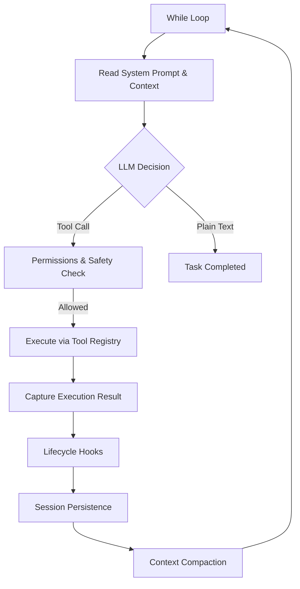

# Deep Dive Reference: Understanding Agent Harness (AI Agent Architecture Framework)

This document is compiled from practical sharing combined with comparing and analyzing technical design patterns in the **harness-kit** project.

---

## 1. Definition of Agent Harness (What is a Harness?)

An **Agent Harness** is a **fixed architecture used to convert a static Large Language Model (LLM) into an independently operating Agent**.

* **Static LLM (Engine)**: By nature, current large language models are one-shot text generators. The user sends a prompt, the model responds and stops. It cannot self-correct, execute actions, or proceed automatically without human intervention.
* **Harness (Car & Steering)**: The wrapping system around the LLM that provides it with the ability to execute actions (via tools), observe the results of those actions, self-correct, and loop until the problem is fully resolved.

> [!NOTE]
> **Core Formula:**
> $$\text{LLM Model (Engine)} + \text{Harness (Car & Steering)} = \text{AI Agent (Self-driving Car)}$$

*Real-world example:* AI programming tools like **Claude Code, Cursor, Windsurf, or Codex** are Agent Harnesses. Each tool originates from a specific problem: how a static LLM can read, write, modify, and test codebase repositories in a secure and consistent manner.

---

## 2. Clear Distinction: Harness vs. Agent Framework

Currently, many people confuse these two concepts. However, the difference between them is massive:

| Criteria | Agent Framework (LangChain, LangGraph, AutoGen, CrewAI...) | Agent Harness (Claude Code, Cursor, Windsurf...) |
| :--- | :--- | :--- |
| **Purpose** | Provides abstract blocks (state, chains, memory, retrievers) for developers to use. | Provides a fully assembled Agent to execute tasks directly. |
| **Assembler** | **Human-centric**: The developer must write code to connect components together. | **Agent-centric**: Designed for the Agent to use the tools itself without human reprogramming. |
| **Out-of-the-box** | Requires developer configuration and workflow setup before use. | No assembly needed; the user only provides the Goal, and the Harness handles the rest. |
| **Core Structure** | A collection of classes, SDK libraries, and high-level abstractions. | A `while` loop combined with a Tool Registry, Permission Layer, and Context Management. |

---

## 3. 9 Core Components of a Modern Agent Harness

A modern Harness is built on 9 mutually supporting components to help the Agent work securely and efficiently:

### 3.1. The While Loop
The foundation of the orchestration system. The Harness runs a continuous `while` loop: read context $\rightarrow$ LLM selects tool $\rightarrow$ execute tool $\rightarrow$ feed result back to context $\rightarrow$ repeat. The loop stops only when the LLM gives a plain text response (task completed) or when it reaches a hard limit (Iteration Cap) to prevent infinite loops.

### 3.2. Context Management
As a session grows longer, conversation history and tool results increase rapidly, easily exceeding the LLM's Context Window.
* **Compaction**: When the context reaches a certain threshold (e.g., 80-90%), the Harness summarizes older turns, retains the most recent ones, and discards verbose details.
* **Progressive Disclosure**: Loads context only when needed (Just-In-Time) to reduce startup latency and optimize token cost.

### 3.3. Tools & Skills Registry
* **Tools**: Universal primitives like file reading/writing, running bash commands, and code searches.
* **Skills**: Higher-level knowledge about workflows (often defined in configuration markdown files), e.g., git commit guidelines or test execution workflows.
* **Registry**: Maps tool names, descriptions, permissions, and handler functions. The registry formats summaries of these tools to the LLM so it knows its capabilities.

### 3.4. Sub-agent Management
When a task is too large or requires parallel processing, the main session context will get bloated. The Harness resolves this by spawning isolated Sub-agents. Each child agent has its own session, a restricted toolset, and a focused system prompt.
* *Principle*: **Spawn** $\rightarrow$ **Restrict** $\rightarrow$ **Collect**.

### 3.5. Built-in Skills
Core primitives that a coding agent must have (file ops, shell execution, code browsing). These should be written in Python standard libraries without external framework dependencies to ensure speed and stability.

### 3.6. Session Persistence / Memory
Long-running sessions are stateful. If the process or terminal crashes, all progress is lost unless written to disk.
* *Implementation*: Use **Append-only JSON Lines** (or Markdown). Every action, tool result, or compaction event is written as a line and immediately flushed to disk. To restore a crashed session, the Harness replays the log line-by-line to reconstruct state.

### 3.7. System Prompt Assembly
The System Prompt is a dynamic pipeline, not a static string. It crawls guidelines like `CLAUDE.md`, `AGENTS.md`, or `.claudemd` in the current and parent directories, assembling them dynamically.
* *Rule*: Put static prompts first and dynamic prompt segments later to protect LLM **Prompt Caching** and avoid cache invalidation latency and cost.

### 3.8. Lifecycle Hooks
Enables extending Harness functionality without modifying its core loop:
* **Pre-tool Hook**: Runs before tool execution to inspect arguments, allow/deny execution, or rewrite inputs.
* **Post-tool Hook**: Runs after tool execution to log, audit, or inspect outputs.
* *Value*: Allows enterprises to enforce compliance, safety, and monitoring.

### 3.9. Permissions & Safety
Protects the user's host system from destructive agent actions:
* **Permission Levels**: Define clear levels (Read-only, Workspace Write, Full Access).
* **Dynamic Command Classification**: Parses shell commands dynamically (e.g., `ls` is Read-only, but `rm -rf` or `shutdown` requires Full Access).
* **Interactive Approvals**: Halts the loop and prompts the user for manual confirmation before executing dangerous commands.

---

## 4. Mapping with harness-kit Evaluation

In our `harness-kit` project, the harness scoring tool (`validate_harness.py`) audits the quality across **5 Subsystems**. We can map the 9 core components of a Harness onto these 5 subsystems as follows:

| 5 Subsystems (harness-kit) | Harness Components | Practical Purpose & Implementation |
| :--- | :--- | :--- |
| **1. Instructions** | • System Prompt Assembly • Tools & Skills Registry | Directs how the agent operates. Reads `AGENTS.md`/`CLAUDE.md` to load rules and list active tools. |
| **2. State** | • Session Persistence • Context Management | Persists progress on disk (`progress.md`, `session-handoff.md`) and manages conversation memory (token compaction). |
| **3. Verification** | • Built-in Skills (Test suite) | Auto-test capabilities (via `init.sh` or testing frameworks) to verify changes before completion. |
| **4. Scope** | • Permissions & Safety • Sub-agent Isolation | Bounds agent actions. Restricts files (`feature_list.json`), prevents path traversal outside workspace, and checks shell safety. |
| **5. Lifecycle** | • While Loop • Lifecycle Hooks | Manages process orchestration from startup, handoff (`session-handoff.md`), to termination. |

---

## 5. Gotchas in Harness Design

Common pitfalls identified in real-world agent deployments:

1. **Silent Memory Caps**: Cache indices often have limits (e.g., 25KB). Storing overly detailed summaries causes older data to be silently truncated.
   * *Fix*: Use short, single-line tags and store verbose details in separate files.
2. **Extraction Timing Race**: Extracting context summaries to memory usually runs at the end of a turn. If a user sends a message too quickly before the save finishes, context is lost.
3. **Classification by API Call instead of Tool Arguments**: Do not classify tools (like running shell) statically.
   * *Fix*: Parse and classify arguments at runtime.
4. **Sub-agent Recursion Token Bloat**: Never allow sub-agents to spawn their own sub-agents (Fork Children Must Not Fork), or token usage will explode exponentially.
5. **Cache Invalidation on File Edits**: When the agent modifies a file, the Harness must invalidate that file's cache immediately to prevent subsequent tools from reading stale data.
6. **All-or-Nothing Hook Trust**: If a workspace is untrusted, disable all local hooks completely rather than filtering them.
